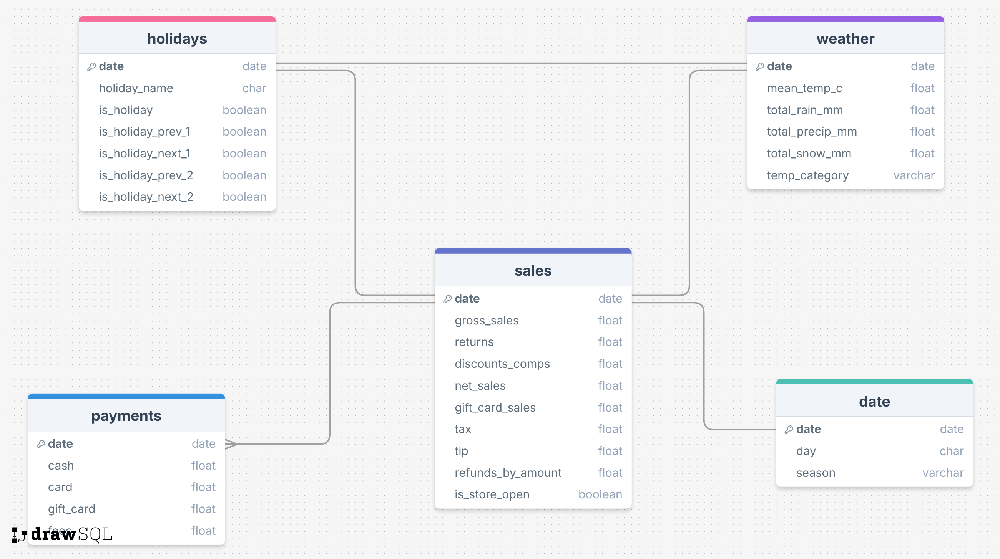

# Veronica's Bakery and Pasta Shop: Sales Analysis

## **Business Description**

Veronica's Bakery and Pasta Shop is based on a real brick-and-mortar bakery located in a Canadian city with a population of 785,000. The shop offers a variety of products, including:

- **Breads and Pastries**: Freshly baked daily.  
- **Sandwiches and Coffee**: Available for dine-in or takeaway.  
- **House-Made Fresh Pasta**: Produced on-site.  
- **Prepared Meals**: Ready-to-go options for convenience.  
- **Gourmet Pantry Items**: Specialty goods for home cooking.

## **Project Overview**

This project focuses on helping Veronica's Bakery enhance **revenue** and **operational efficiency** by analyzing sales data in relation to **holidays, weather conditions, and historical trends**. Key steps included **data cleaning**, **exploratory data analysis**, **hypothesis testing**, **machine learning modeling**, and delivering **actionable recommendations** through visualizations and KPIs.

## Table of Contents

- [Business Problem](#business-problem)
- [Data](#data)
- [Process](#process)
- [Tools Used](#tools-used)
- [Results](#results)
- [Recommendations](#actionable-recommendations)
- [How to Navigate Through the Project Files](#how-to-navigate-through-the-project-files)
- [Links](#links)

## **Business Problem**

As a former chef and baker, making decisions about **staffing** and **food preparation** during holidays or specific weather conditions was often a challenge. These decisions frequently felt like a gamble, with the risk of being **over-prepared** or **under-prepared**. This analysis aims to solve these challenges by providing insights into how **sales patterns** are influenced by **holidays** and **weather conditions**.

### **Key Questions to Answer:**

1. Which **days, months, and seasons** have the highest sales?  
2. How do **rainfall, snowfall, and temperature** affect sales?  
3. How do sales fluctuate around the **holidays** compared to regular days?

## **Data**

- **Sales Data**: Gathered from the point-of-sale app at the shop covering **February 2023 to November 2024**.  
- **Weather Data**: Retrieved from the **Government of Canada Climate Weather Website**.
- **Holiday Data**: Imported using the **Python `holidays` library**.

## **Process**

### **Outline of Steps:**

1. **Data Collection**  
   - Collected sales, weather, and holiday data.

2. **Data Cleaning**  
   - Merged datasets, standardized column names, and filtered relevant dates.

3. **Relational Database Setup**  
   - Designed an ERD, created a MySQL schema, and implemented a relational database for organized data storage.
   

4. **Exploratory Data Analysis (EDA)**  
   - Identified patterns and trends in the data using visualizations.

5. **Feature Engineering**  
   - Created new features like `temp_category`, `season`, and holiday proximity indicators.

6. **Statistical Testing**  
   - Conducted hypothesis tests to validate insights:
     - **ANOVA**: Average sales by day of the week  
     - **Mann-Whitney U Test**: Sales on rainy vs. non-rainy days  
     - **t-test**: Sales on snowy vs. non-snowy days  
     - **Mann-Whitney U Test**: Sales on holidays vs. non-holidays  
     - **Kruskal-Wallis Test**: Sales across seasons  

7. **Calculate Key Performance Indicators (KPIs)**  
   - Derived insights from metrics like average sales, sales growth, and holiday impact.

8. **Model Building**  
   - **Trained five models**:
     1. **Linear Regression**  
     2. **Decision Tree Regressor**  
     3. **Random Forest Regressor**  
     4. **Gradient Boosting Regressor**  
     5. **XGBoost Regressor**  

9. **Visualization and Dashboarding**  
   - **Python**: Created plots and charts for data exploration.  
   - **Tableau**: Developed interactive dashboards for customer behavior, weather and holiday trends, and KPIs.

10. **Creation of Presentation Slides**  
    - Summarized the analysis, findings, and recommendations.

## **Tools Used**

- **Visual Studio Code**
- **Python Libraries**:  
  - `pandas`  
  - `numpy`  
  - `matplotlib.pyplot`  
  - `seaborn`  
  - `scipy.stats`  
  - `sklearn`  
  - `xgboost`  
  - `holidays`  
  - `datetime`  
  - `yaml`  
- **MySQL**
- **Tableau**

## **Results**

### **Brief Summary of Key Findings:**

1. **Customer Behavior**:  
   - **Highest Sales**: Fridays and Saturdays | November and December.
   - **Lowest Sales**: Mondays and Tuesdays | February and March.  
   - **Gift Card Sales** peak in **November and December**.

2. **Weather Impact**:  
   - **Warmer Temperatures** correlate with higher sales.  
   - **Rainfall** does not significantly impact sales.  
   - **Snowfall** correlates with **lower sales** on snowy days.

3. **Holiday Trends**:  
   - Sales are **lower on holidays** compared to regular days.  
   - Sales rebound **two days after holidays**.  
   - **Good Friday** has the highest average sales.

4. **Statistical Tests**

| **Hypothesis**                | **Test**       | **p-Value**  | **Conclusion**              |
|-------------------------------|----------------|--------------|---------------------------  |
| **Sales by Day of the Week**  | ANOVA          | 5.99e-91     | ✅ Significant Difference   |
| **Rainy vs. Non-Rainy Days**  | Mann-Whitney U | 0.7983       | ❌ No Significant Difference|
| **Snowy vs. Non-Snowy Days**  | t-test         | 0.02895      | ✅ Significant Difference   |
| **Holidays vs. Non-Holidays** | Mann-Whitney U | 0.02177      | ✅ Significant Difference   |
| **Sales Across Seasons**      | Kruskal-Wallis | 0.06363      | ❌ No Significant Difference|

---

These findings highlight the **significant patterns** in sales behavior based on days of the week, holidays, and weather conditions. They provide a solid foundation for the recommendations aimed at optimizing **staffing, inventory planning, and promotions**.

5. **Model Performance**:  
   - **Linear Regression**:  
     - **MSE**: 1,120,112.41 | **R²**: 50.2%  
   - **Gradient Boosting**:  
     - **MSE**: 1,172,775.89 | **R²**: 47.9%

## **Actionable Recommendations**:

### 1. Daily Sales Targets
- **Benchmark Goal:** Aim for a daily sales target of **$3,125.42**. This target serves as a benchmark to evaluate performance, optimize staffing, and allocate resources effectively.
- **Dynamic Adjustments:** Incorporate variability in targets based on historical trends and seasonality to refine performance metrics.

#### Upselling and Product Recommendation Strategies
To meet daily sales targets, implement strategies to increase the average transaction value and frequency of purchases:

- **Premium Options:**
  - Offer premium versions of popular items, such as artisanal bread, specialty coffee roasts, or deluxe sandwich options.
  - Highlight premium items on menus, counters, or digital boards with enticing descriptions and imagery.

- **Bundling Discounts:**
  - Create product bundles (e.g., coffee + pastry, pasta + gourmet pantry item) at a slight discount to encourage customers to spend more.
  - Promote the bundles with labels like "Customer Favorites" or "Best Value."

- **Suggestive Selling at Checkout:**
  - Train staff to suggest add-ons like desserts, beverages, or gift items during transactions.
  - Use point-of-sale (POS) prompts to recommend add-ons automatically (e.g., "Would you like to add a croissant to your coffee for $2 more?").

- **Seasonal Upsells:**
  - Leverage seasonal items (e.g., pumpkin spice lattes, holiday-themed baked goods) and limited-time offers to create urgency and increase sales.

---

### 2. **Promotions and Discounts**
- **Day-Specific Promotions:** Offer special discounts or promotions on **Mondays and Tuesdays**, days with typically lower foot traffic, to attract more customers.
- **Seasonal Campaigns:** Focus marketing efforts on **February and March**, historically slower months, by introducing seasonal products or offering discounts on popular items.
- **Holiday Specials:** Align promotions around holidays to leverage increased consumer spending and festive demand.

---

### 3.**Weather-Specific Strategies**
- **Menu Adjustments:** Adapt offerings based on weather patterns (e.g., soups and hot drinks on colder days; iced beverages and light meals during hot weather).
- **Promotional Messaging:** Tailor marketing communications to weather conditions to create timely and relevant engagement.
- **Stock Optimization:** Use weather forecasts to adjust inventory levels, reducing waste and ensuring popular items are in stock.

---

### 4. **Holiday Rebound Strategy**
- **Post-Holiday Boost:** Develop a strategy to maximize the sales increase typically observed **two days after holidays**, referred to as the "holiday rebound."
  - **Limited-Time Offers:** Create post-holiday exclusive discounts to entice repeat visits.
  - **Gift Card Promotions:** Promote the use of gift cards purchased during the holidays to drive foot traffic.
  - **Upselling and Cross-Selling:** Leverage post-holiday high traffic to introduce new items or upsell premium products.

---

### 5. **Cost-Benefit Analysis**
- **Holiday Operations:** Conduct a profitability analysis for opening on holidays, factoring in labor costs, potential sales, and operational overhead.
- **Scenario Planning:** Simulate scenarios for holiday sales performance to make data-driven decisions on whether to open or close during holidays.

---

### 6. **Enhance Data Collection**
#### Improve POS System:
- **Itemized Sales Data:** Collect detailed data on every item sold, including quantities, categories, and timestamps, to enable market basket analysis and understand purchasing patterns.
- **Customer Purchase History:** Integrate customer-level purchase tracking, linking transactions to loyalty accounts or membership cards.
- **Category Trends:** Analyze sales by product category (e.g., baked goods, pasta, coffee, etc.) to optimize inventory and forecast demand.
- **Time-Based Trends:** Collect hourly sales data to identify peak periods and allocate staffing more efficiently.
- **Discount Effectiveness:** Track the performance of specific promotions and discounts by measuring lift in sales.

#### Customer Insights App:
- **Demographics:** Gather data on customer age, gender, income levels, and other key demographics for targeted marketing.
- **Visit Frequency:** Track how often customers visit, purchase amounts per visit, and trends in repeat purchases.
- **Feedback and Preferences:** Collect direct customer feedback on products, promotions, and service quality through surveys or app interactions.
- **Engagement Metrics:** Monitor app usage, response to push notifications, and reward redemptions for insights into customer behavior.
- **Referral Data:** Capture details on referral patterns to understand word-of-mouth impact.

---

### 7. **Market Basket Analysis**
- **Objective:** Use enhanced POS data to identify product combinations frequently purchased together (e.g., coffee and pastries) to develop bundling strategies.
- **Cross-Selling Opportunities:** Design marketing campaigns or point-of-sale suggestions to encourage complementary purchases based on analysis results.

---

### 8. **Customer Loyalty and Behavior Insights**
#### Loyalty Program Implementation:
- Offer loyalty points or rewards to encourage repeat visits and collect detailed data on purchasing behavior.
- Analyze the impact of loyalty incentives on revenue and customer retention.

#### Personalized Marketing:
- Use collected customer data to tailor promotions, product recommendations, and communication for a more personalized customer experience.

## **How to Navigate Through the Project Files**

1. **Data**: Contains cleaned datasets used for analysis.  
2. **SQL**: Entity Relationship Diagram (ERD) diagram. Schema and queries for database creation and management.  
3. **Notebooks**: Code for data cleaning, EDA, statistical tests, and model building.  
4. **Dashboards**: Tableau workbooks for interactive visualizations.  
6. **Figures**: Plots created on Python.
5. **Presentation Slides**: Summary of findings and recommendations.

## **Links**

### **Tableau Dashboards**

- **Sales Insights**: [View Dashboard](https://public.tableau.com/app/profile/jonathan.tsui8842/viz/Veronicas_dashboards/Insights?publish=yes)  
- **Holiday and Weather Trends**: [View Dashboard](https://public.tableau.com/app/profile/jonathan.tsui8842/viz/Veronicas_dashboards/Trends?publish=yes)  
- **Key Performance Indicators**: [View Dashboard](https://public.tableau.com/app/profile/jonathan.tsui8842/viz/Veronicas_dashboards/KPI?publish=yes)  
